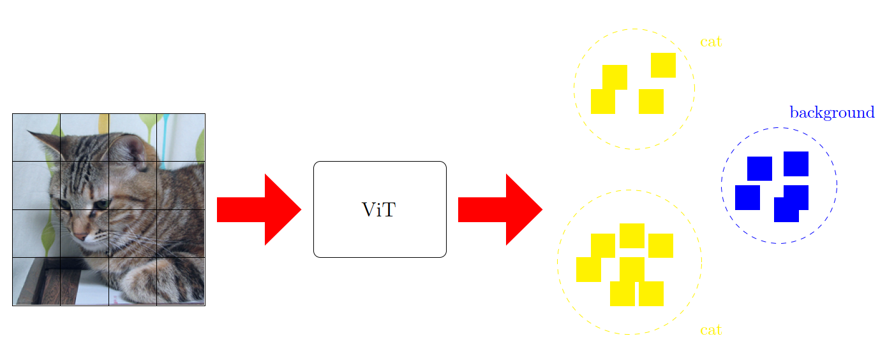

# Clustering Segmentation based on iBOT
Studying well-structuredness of 
<a href="https://github.com/bytedance/ibot">iBOT's</a> learned feature space using 
Linear Probing, K-Nearest Neighbors, K-Means and Agglomerative Clustering.


## Installation
System Requirements:
* Python 3.7.9
* Cuda 11.0

Install packages by running
```sh
pip install -r requirements.txt
```

Make sure to download the <a href="http://host.robots.ox.ac.uk/pascal/VOC/voc2012/index.html">PASCAL VOC Dataset</a> and the models pretrained on ImageNet-22K:
<ul>
  <li> ViT-Base: <a href=https://lf3-nlp-opensource.bytetos.com/obj/nlp-opensource/archive/2022/ibot/vitb_16_pt22k/checkpoint.pth> full cpkt </a>
  <li> ViT-Large: <a href="https://lf3-nlp-opensource.bytetos.com/obj/nlp-opensource/archive/2022/ibot/vitl_16_pt22k/checkpoint.pth"> full cpkt </a>
</ul>

## Evaluation
Each method can be evaluated by running its respective script
```sh
python eval_linear.py
python eval_knn.py
python eval_kmeans.py
python eval_agglomerative.py
```
together with the specified settings. For further details, please either run the script
with a `--help` flag or refer to our provided example 
<a href="https://github.com/aselimc/iBot-cv/tree/main/example">bash scripts</a>.

## Segmentation

<table>
  <tr>
    <td></td>
    <td></td>
    <td></td>
    <td></td>
  </tr>
  <tr>
  <td></td>
  <td></td>
  <td></td>
  <td></td>
  </td>
</table>

## Mean Intersection over Union
Linear Probing
<table>
  <tr>
    <td>Arch</td>
    <td colspan=4 align="center">Intermediate</td>
    <td colspan=4 align="center">Query</td>
    <td colspan=4 align="center">Key</td>
    <td colspan=4 align="center">Value</td>
  </tr>
  <tr>
    <td></td>
    <td>1%</td>
    <td>10%</td>
    <td>50%</td>
    <td>100%</td>
    <td>1%</td>
    <td>10%</td>
    <td>50%</td>
    <td>100%</td>
    <td>1%</td>
    <td>10%</td>
    <td>50%</td>
    <td>100%</td>
    <td>1%</td>
    <td>10%</td>
    <td>50%</td>
    <td>100%</td>
  </tr>
  <tr>
    <td>ViT-Base</td>
    <td></td>
    <td></td>
    <td></td>
    <td></td>
    <td></td>
    <td></td>
    <td></td>
    <td></td>
    <td></td>
    <td></td>
    <td></td>
    <td></td>
    <td></td>
  </tr>
  <tr>
    <td>ViT-Large</td>
    <td>0.237</td>
    <td>0.517</td>
    <td>0.655</td>
    <td>0.675</td>
    <td>0.171</td>
    <td>0.462</td>
    <td>0.603</td>
    <td>0.619</td>
    <td>0.200</td>
    <td>0.322</td>
    <td>0.450</td>
    <td>0.448</td>
    <td>0.205</td>
    <td>0.478</td>
    <td>0.615</td>
    <td>0.637</td>
  </tr>
</table>

KNN
<table>
  <tr>
    <td>Arch</td>
    <td colspan=4 align="center">Intermediate</td>
    <td colspan=4 align="center">Query</td>
    <td colspan=4 align="center">Key</td>
    <td colspan=4 align="center">Value</td>
  </tr>
  <tr>
    <td></td>
    <td>1%</td>
    <td>10%</td>
    <td>50%</td>
    <td>100%</td>
    <td>1%</td>
    <td>10%</td>
    <td>50%</td>
    <td>100%</td>
    <td>1%</td>
    <td>10%</td>
    <td>50%</td>
    <td>100%</td>
    <td>1%</td>
    <td>10%</td>
    <td>50%</td>
    <td>100%</td>
  </tr>
  <tr>
    <td>ViT-Base</td>
    <td></td>
    <td></td>
    <td></td>
    <td></td>
    <td></td>
    <td></td>
    <td></td>
    <td></td>
    <td></td>
    <td></td>
    <td></td>
    <td></td>
    <td></td>
  </tr>
  <tr>
    <td>ViT-Large</td>
    <td>0.288</td>
    <td>0.511</td>
    <td>0.580</td>
    <td>0.601</td>
    <td>0.214</td>
    <td>0.451</td>
    <td>0.544</td>
    <td>0.575</td>
    <td>0.237</td>
    <td>0.454</td>
    <td>0.540</td>
    <td>0.559</td>
    <td>0.258</td>
    <td>0.477</td>
    <td>0.551</td>
    <td>0.574</td>
  </tr>
</table>

KMeans
<table>
  <tr>
    <td>Arch</td>
    <td colspan=4 align="center">Intermediate</td>
    <td colspan=4 align="center">Query</td>
    <td colspan=4 align="center">Key</td>
    <td colspan=4 align="center">Value</td>
  </tr>
  <tr>
    <td></td>
    <td>1%</td>
    <td>10%</td>
    <td>50%</td>
    <td>100%</td>
    <td>1%</td>
    <td>10%</td>
    <td>50%</td>
    <td>100%</td>
    <td>1%</td>
    <td>10%</td>
    <td>50%</td>
    <td>100%</td>
    <td>1%</td>
    <td>10%</td>
    <td>50%</td>
    <td>100%</td>
  </tr>
  <tr>
    <td>ViT-Base</td>
    <td></td>
    <td></td>
    <td></td>
    <td></td>
    <td></td>
    <td></td>
    <td></td>
    <td></td>
    <td></td>
    <td></td>
    <td></td>
    <td></td>
    <td></td>
    <td></td>
    <td></td>
    <td></td>
  </tr>
  <tr>
    <td>ViT-Large</td>
    <td></td>
    <td></td>
    <td></td>
    <td></td>
    <td></td>
    <td></td>
    <td></td>
    <td></td>
    <td></td>
    <td></td>
    <td></td>
    <td></td>
    <td></td>
    <td></td>
    <td></td>
    <td></td>
  </tr>
</table>

Agglomerative Clustering
<table>
  <tr>
    <td>Arch</td>
    <td colspan=4 align="center">Intermediate</td>
    <td colspan=4 align="center">Query</td>
    <td colspan=4 align="center">Key</td>
    <td colspan=4 align="center">Value</td>
  </tr>
  <tr>
    <td></td>
    <td>1%</td>
    <td>10%</td>
    <td>50%</td>
    <td>100%</td>
    <td>1%</td>
    <td>10%</td>
    <td>50%</td>
    <td>100%</td>
    <td>1%</td>
    <td>10%</td>
    <td>50%</td>
    <td>100%</td>
    <td>1%</td>
    <td>10%</td>
    <td>50%</td>
    <td>100%</td>
  </tr>
  <tr>
    <td>ViT-Base</td>
    <td></td>
    <td></td>
    <td>0.483</td>
    <td>0.509</td>
    <td></td>
    <td></td>
    <td></td>
    <td>0.357</td>
    <td></td>
    <td></td>
    <td></td>
    <td>0.395</td>
    <td></td>
    <td></td>
    <td></td>
    <td>0.454</td>
  </tr>
  <tr>
    <td>ViT-Large</td>
    <td></td>
    <td>0.506</td>
    <td>0.511</td>
    <td>0.537</td>
    <td></td>
    <td>0.402</td>
    <td>0.414</td>
    <td>0.417</td>
    <td></td>
    <td>0.406</td>
    <td>0.436</td>
    <td>0.451</td>
    <td></td>
    <td>0.445</td>
    <td>0.463</td>
    <td>0.486</td>
  </tr>
</table>