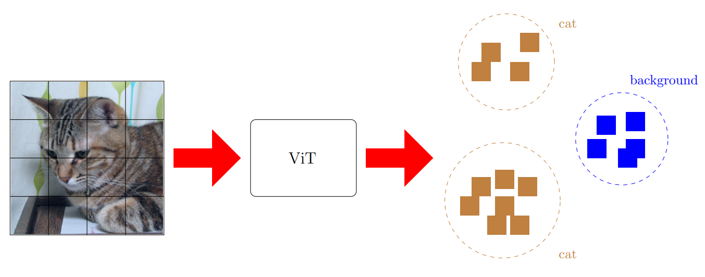

# Clustering Segmentation based on iBOT
Studying well-structuredness of 
<a href="https://github.com/bytedance/ibot">iBOT's</a> learned feature space using 
Linear Probing, K-Nearest Neighbors, K-Means and Agglomerative Clustering.


## Installation
System Requirements:
* Python 3.7.9
* Cuda 11.0

Install packages by running
```sh
pip install -r requirements.txt
```

Make sure to download the <a href="http://host.robots.ox.ac.uk/pascal/VOC/voc2012/index.html">PASCAL VOC Dataset</a> and the models pretrained on ImageNet-22K:
<ul>
  <li> ViT-Base: <a href=https://lf3-nlp-opensource.bytetos.com/obj/nlp-opensource/archive/2022/ibot/vitb_16_pt22k/checkpoint.pth> full cpkt </a>
  <li> ViT-Large: <a href="https://lf3-nlp-opensource.bytetos.com/obj/nlp-opensource/archive/2022/ibot/vitl_16_pt22k/checkpoint.pth"> full cpkt </a>
</ul>

## Evaluation
Each method can be evaluated by running its respective script
```sh
python eval_linear.py
python eval_knn.py
python eval_kmeans.py
python eval_agglomerative.py.py
```
together with the specified settings. For further details, please either run the script
with a `--help` flag or refer to our provided example 
<a href="https://github.com/aselimc/iBot-cv/tree/main/example">bash scripts</a>.

## Segmentation
| | | | |
|:-------------------------:|:-------------------------:|:-------------------------:|:-------------------------:|
||||
||||
